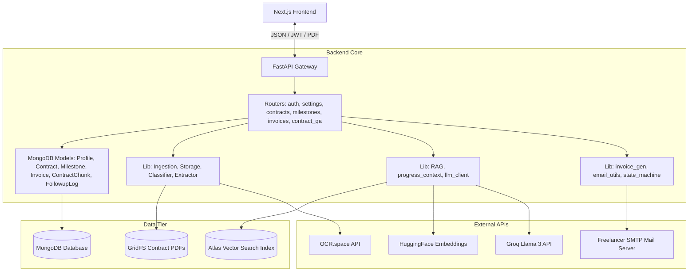

# Technical Architecture & Component Walkthrough: On-It

On-It is an AI-powered freelance contract management platform. It automates contract ingestion, milestone extraction, invoice generation, and document question-answering (RAG) with NLI-based faithfulness verification.

This document serves as an exhaustive technical directory, explaining the role, file paths, and operations of every component across the system.

---

## Codebase Map & Layout



---

## 1. Backend Architecture

The backend is built with **FastAPI**, **MongoDB** (with GridFS for PDF storage and Atlas Vector Search for RAG), and **Groq Cloud API** (Llama 3 models) for artificial intelligence.

### 1.1 Entrypoint & Configs

*   **`backend/main.py`**
    *   **Purpose**: Bootstraps the FastAPI server.
    *   **How it works**: Registers CORSMiddleware (allowing React connections), mounts routes under `/api`, and hooks up start/stop lifecycle functions.
*   **`backend/config.py`**
    *   **Purpose**: Centralized environmental variable manager.
    *   **How it works**: Manages credentials (JWT Secrets, Groq keys, HuggingFace tokens, OCR.space keys, SMTP global backups) with default fallbacks and threshold constraints (e.g. RAG `NLI_FAITHFULNESS_THRESHOLD = 0.7`).
*   **`backend/db.py`**
    *   **Purpose**: MongoDB client provider.
    *   **How it works**: Returns active connections to target collections.

---

### 1.2 Database Models (`backend/models/`)

On-It relies on schemaless MongoDB, structured using **Pydantic** models on the backend:

1.  **`profiles.py`**: Freelancer profiles. Stores credentials, `default_gst_rate`, `invoice_prefix`/`counter`, and credentials for manual SMTP. Houses `auth_provider`, and local email validation tokens (`verification_token`, `email_verified`).
2.  **`contracts.py`**: Tracks ingested contracts, statuses (`processing`, `extracted`, `review_required`, `failed`), client metadata, currency details, and the file pointer `file_url`.
3.  **`contract_chunks.py`**: Extracted contract section texts alongside 384-dimension HuggingFace vector embeddings, indexed for Atlas Vector Search.
4.  **`milestones.py`**: Payment milestones. Stores status (`PENDING`, `TRIGGERED`, `INVOICED`, `OVERDUE`, `PAID`), triggers, deliverables, percentages, and calculated INR amounts.
5.  **`invoices.py`**: Metadata of generated invoices, including calculated GST taxes, original amounts, and GridFS `pdf_file_id`.
6.  **`followup_logs.py`**: Audit logs of sent automated payment reminders.

---

### 1.3 Core Library Layer (`backend/lib/`)

The engineering heavy-lifting resides in these specialized library utilities:

#### `ingestion.py`
*   **Purpose**: Extracts raw text from uploaded files and segments it into semantic sections.
*   **How it works**: 
    1.  Uses `python-docx` for `.docx` documents.
    2.  For PDFs, checks if the document is native (searchable) or scanned by sampling characters with `pdfplumber`.
    3.  If native, extracts text directly; if scanned, calls **OCR.space API** (using table structures).
    4.  Runs a rule-based tokenizer to split the text into chunks whenever heading signals (Heading 1/2 in docx) or specific boundary keywords (e.g. "ARTICLE", "LIQUIDATION", "INDEMNITY") occur.

#### `classifier.py`
*   **Purpose**: Classifies a contract's overall payment agreement style.
*   **How it works**: Prompts Groq with a short-context JSON request to identify if the contract is `fixed_price`, `retainer`, `phase_based`, `advance`, or `unsupported`.

#### `extractor.py`
*   **Purpose**: Extracts complex structured metadata (milestones, dates, deliverables) in a single LLM pass.
*   **How it works**: Feeds the first 16,000 characters of the text to Groq requesting a defined JSON schema. Includes a helper `resolve_amounts()` that automatically computes raw milestone values using percentages if the overall project value confidence is high enough.

#### `storage.py`
*   **Purpose**: Binary storage manager.
*   **How it works**: Leverages MongoDB GridFS to stream PDFs into the DB without exceeding the 16MB document size limit.

#### `state_machine.py`
*   **Purpose**: Implements the milestone lifecycle and handles transitions.
*   **How it works**:
    *   Transition diagram: `PENDING` $\rightarrow$ `TRIGGERED` $\rightarrow$ `INVOICED` $\rightarrow$ `OVERDUE` / `PAID`.
    *   Saves events into a audit collection (`milestone_events`).
    *   If a milestone is `recurring`, marking it `PAID` triggers the automatic creation of the next milestone, moving its `trigger_date` forward by a month.
    *   `run_pending_checks()` evaluates milestones and transitions past-due invoices to OVERDUE status.

#### `invoice_gen.py`
*   **Purpose**: Renders professional PDF invoices and writes email cover notes.
*   **How it works**:
    *   Builds data (calculates GST rates and final totals).
    *   Renders an A4 PDF using **ReportLab**'s flowable objects (Paragraphs, Spacers, structured tables).
    *   Prompts Groq with the client and payment details to dynamically author a context-aware 2-sentence cover note email (tone varying based on overdue duration).

#### `email_utils.py`
*   **Purpose**: Dispatches emails with invoice attachments.
*   **How it works**: Authenticates with SMTP. It dynamically chooses the freelancer's custom SMTP configuration (securely decrypted from their profile) and falls back to a global server if they do not have custom SMTP credentials.

#### `progress_context.py`
*   **Purpose**: Synthesizes real-time status data.
*   **How it works**: Aggregates total contract value, paid count, invoiced amount, and overdue milestones into a clean summary payload.

#### `rag.py`
*   **Purpose**: Document Question & Answering (Chat).
*   **How it works**:
    1.  Embeds the user's query using HuggingFace inference.
    2.  Performs an Atlas Vector Search to retrieve the top-K relevant contract chunks.
    3.  Appends the real-time contract progress summary (`progress_context.py`).
    4.  Asks Groq to generate a JSON response, forcing citations (`section_ref`).
    5.  Runs an NLI check (`score_faithfulness`) asking Groq to act as a judge comparing the generated answer against the source sections. If the score falls below the threshold (0.7), it blocks the hallucination and outputs a safe fallback.

---

### 1.4 API Routers (`backend/routers/`)

*   **`auth.py`**: Handles manual registration, email verification links, traditional login, and the Google OAuth code-exchange callback (`/api/auth/google`).
*   **`settings.py`**: Profile updates. Masking/stripping sensitive properties (like SMTP passwords and Google tokens) ensures they never leak to the client.
*   **`contracts.py`**: File upload triggers and contract detail fetches.
*   **`milestones.py`**: Actions to trigger, invoice, or mark milestones paid.
*   **`invoices.py`**: Access routes to generated PDF files, email templates, and invoice deliveries.
*   **`contract_qa.py`**: RAG chat endpoint.

---

## 2. Frontend Architecture (Next.js)

The frontend is a single-page application structure styled using custom **Vanilla CSS** (defined in `globals.css` with a custom Glassmorphic design system) and **Next.js App Router** logic.

### 2.1 Navigation & Layout Structure

*   **`frontend/components/AppLayout.tsx`**
    *   **Purpose**: Application wrapper shell.
    *   **How it works**: Merges the navigation Sidebar, responsive top Header, and wraps the content within a unified page layout.
*   **`frontend/components/Sidebar.tsx`**
    *   **Purpose**: Main navigation panel.
    *   **How it works**: Lists links (Dashboard, Upload Contract, Settings) and handles logouts.
*   **`frontend/components/ProtectedRoute.tsx`**
    *   **Purpose**: Client-side authentication guard.
    *   **How it works**: Listens to the `AuthContext` loading states and forces unauthenticated users back to `/auth/login`.

---

### 2.2 Shared Global Contexts

*   **`frontend/context/AuthContext.tsx`**
    *   **Purpose**: Manages JWT token storage and current session states.
    *   **How it works**: Stores local storage tokens, tracks the logged-in profile object (useful for detecting `auth_provider` type), and routes users post-login.
*   **`frontend/components/ThemeContext.tsx`**
    *   **Purpose**: Theme engine (Light/Dark mode).
    *   **How it works**: Toggles dark classes on the HTML document, reading/writing preferences from localStorage.

---

### 2.3 Interactive Views (`frontend/app/`)

*   **`page.tsx` (Landing Page)**: A landing page introducing On-It's automation benefits (RAG chat, automated invoices), with access routes to login/register.
*   **`dashboard/page.tsx`**: Aggregated tracking view showing metrics (Overdue invoices, outstanding balances, paid values), invoice lists, and active contract cards.
*   **`contracts/[id]/page.tsx` (Contract Detail)**:
    *   Renders overall contract metadata.
    *   Displays milestone columns.
    *   Provides access to the GridFS PDF copy and triggers the RAG Chat drawer.
*   **`verify-email/page.tsx`**: A dedicated landing route that extracts verification tokens from queries, makes the verification callback, and presents appropriate feedback.
*   **`settings/page.tsx`**: Configures business profiles (GSTIN, Address, Organization Name), traditional SMTP server configurations, and manages theme settings.

---

### 2.4 Reusable UI Components

*   **`MilestoneCard.tsx`**
    *   **Purpose**: Individual milestone view card.
    *   **How it works**: Adapts its interactive buttons based on status:
        *   `PENDING` $\rightarrow$ "Trigger Deliverable"
        *   `TRIGGERED` $\rightarrow$ "Generate Invoice" (which opens the invoice drawer)
        *   `INVOICED` $\rightarrow$ "Mark Paid" and "View Invoice"
*   **`InvoicePreview.tsx`**
    *   **Purpose**: Slide-over panel for invoice confirmation.
    *   **How it works**: Allows editing the invoice amount, displays a live preview of the LLM-written email cover note, and enables the user to trigger the final SMTP dispatch.
*   **`ContractQA.tsx`**
    *   **Purpose**: Document RAG chat interface.
    *   **How it works**: Slides out from the right. Maintains local conversation histories, handles the streaming-like interaction states, and lists relevant citations (`section_ref`).

---

## 3. Communication Patterns

```
[Frontend View] 
      │
      ├─(1) apiFetch() HTTP Request with Bearer Token ───────────┐
      │                                                          ▼
[FastAPI Router] ◄────────────────────────────────────────[JWT Middleware] (verify & extract freelancer_id)
      │
      ├─(2) Fetch documents matching freelancer_id
      │
      ├─(3) Invoke background task or invoke Lib helper
      │
      ├─(4) Call External APIs (OCR, Groq, HuggingFace)
      │
      ▼
[Response JSON] ──► Render on Component with Glassmorphism
```
